# iOSJailbreakDetection

iOS的ObjC的app，实现越狱检测功能

## 功能介绍

主要分2部分=2个页面：

* 文件类的越狱检测 = `JbDetectOpenFileViewController`
* 其他方面的越狱检测 = `JbDetectOtherViewController`

## 检测效果举例

此处有一个越狱手机，iPhone7，下面是检测结果：

### 文件类的：JbDetectOpenFileViewController

初始化默认显示：

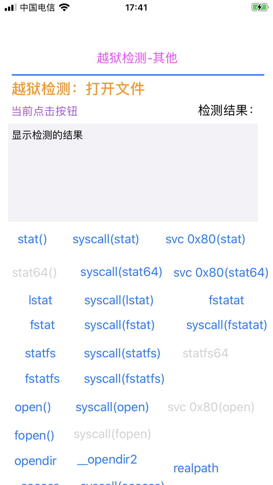

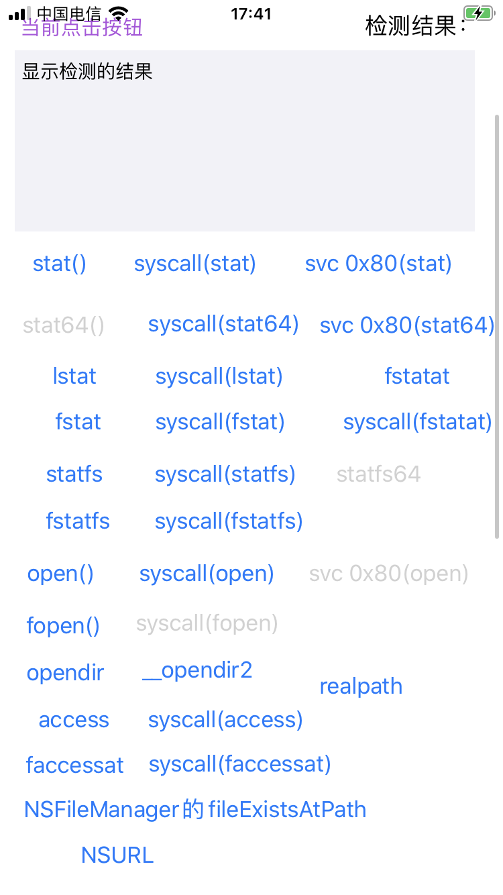

分别点击一些按钮，对应的检测出的结果，即越狱文件路径的个数：

* `stat`: `43`
  * 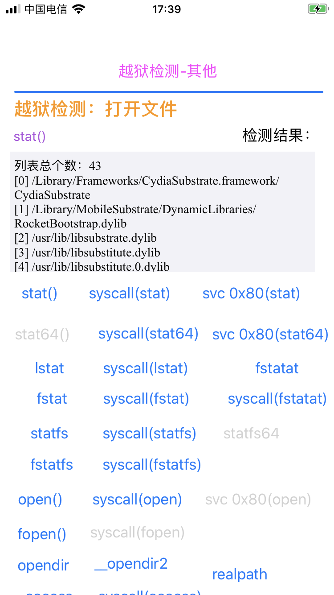
* `lstat`: `8`
  * 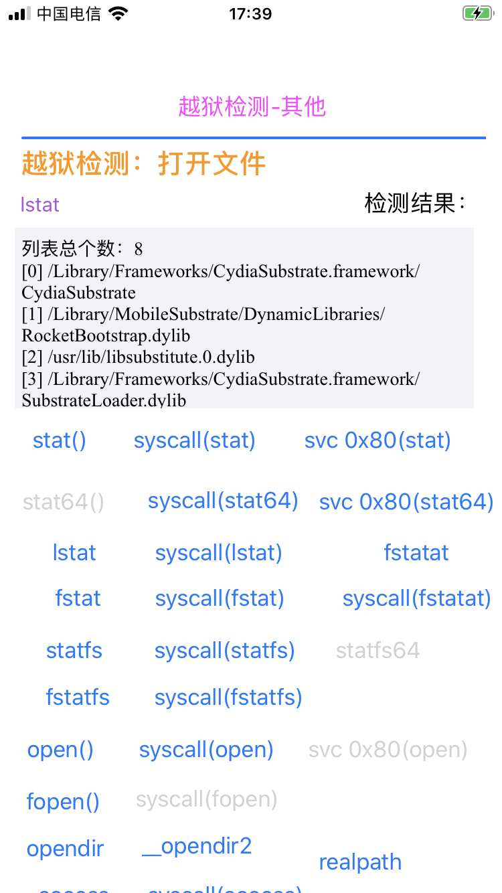
* `statfs`: `77`
  * 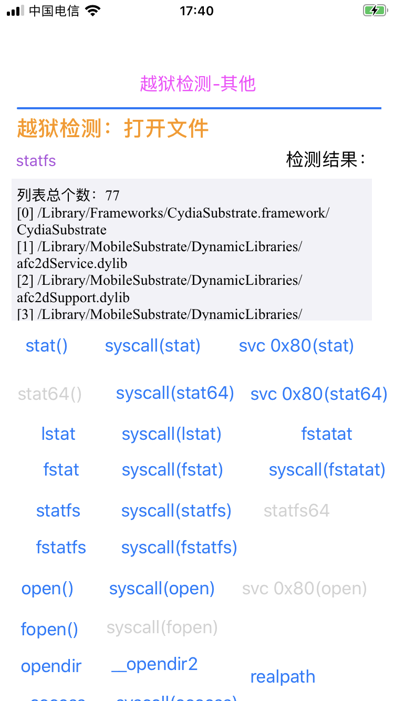
* `opendir`: `0`
  * 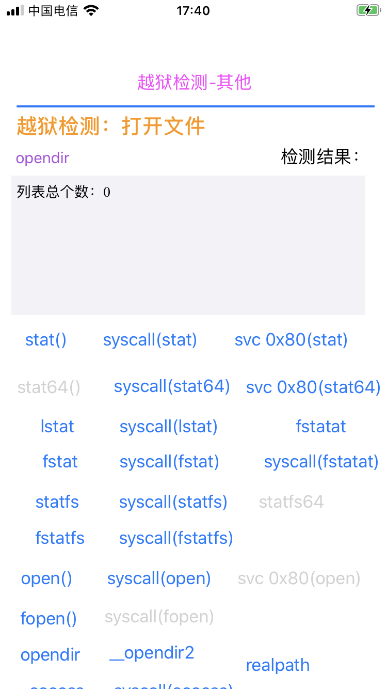

### 其他的：JbDetectOtherViewController

初始化默认显示：

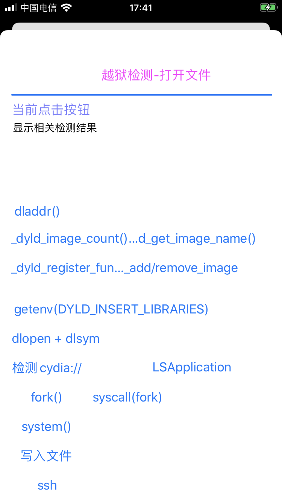

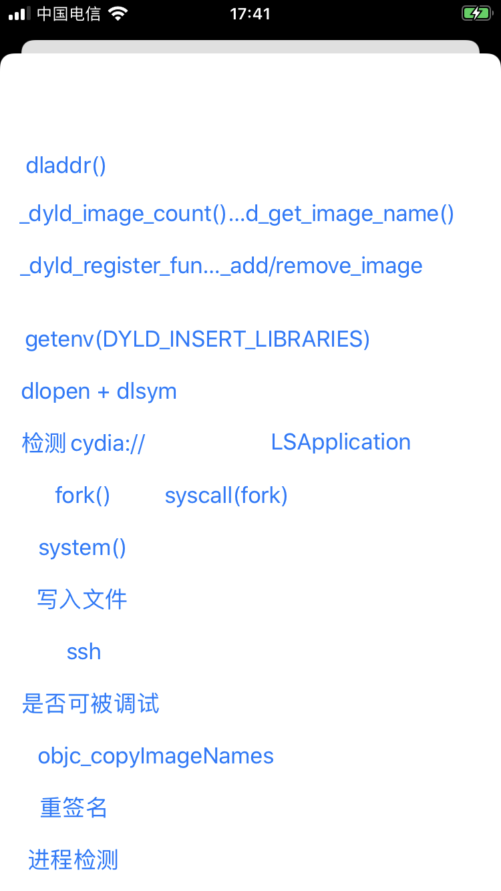

分别点击一些按钮，对应的检测出的结果，即是否是越狱手机，以及异常的越狱手机才会有的动态库dylib文件的个数：

* `cydia`：是越狱手机
  * 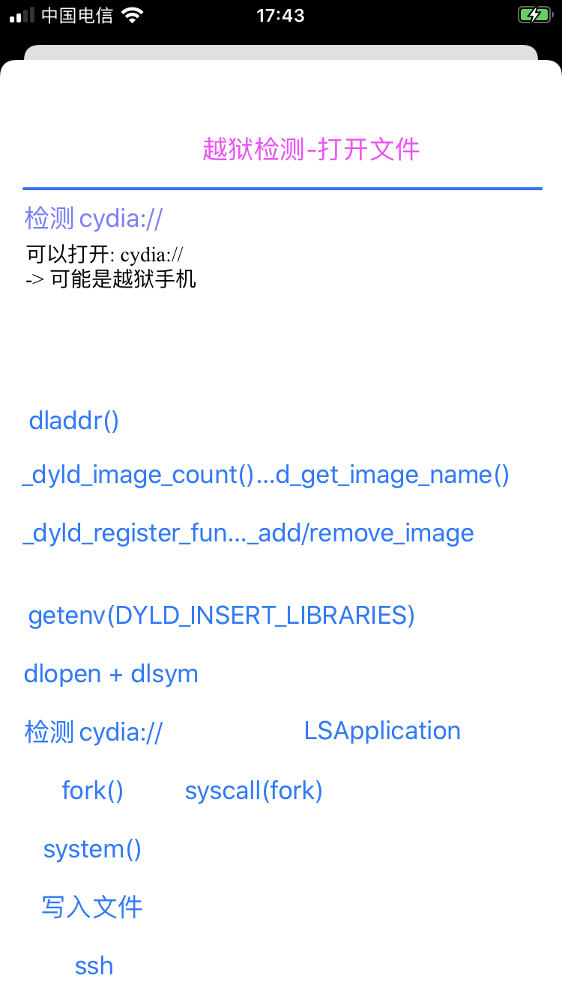
* `dlopen+dlsym`：是越狱手机，4个
  * 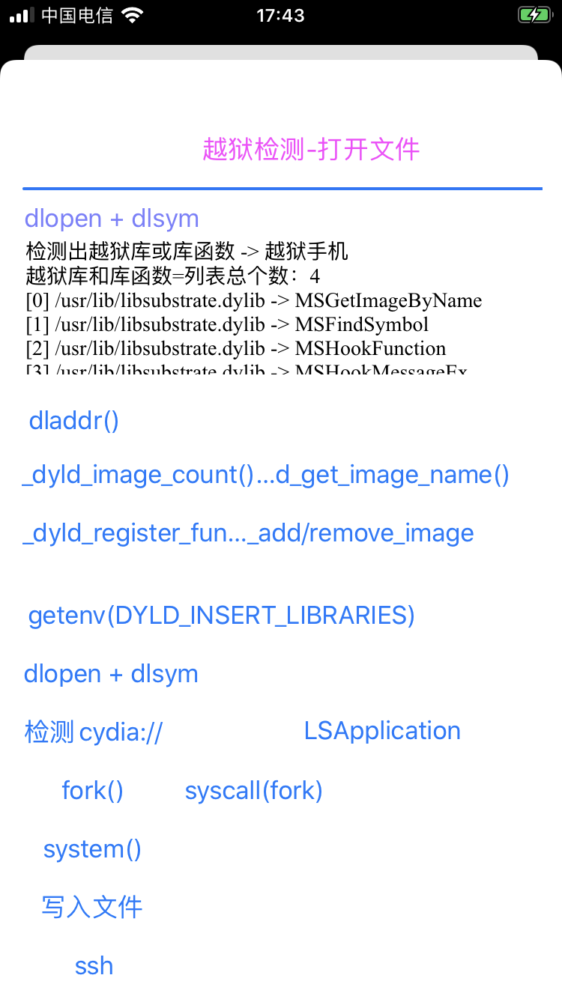
* `_dyld_image_count() + _dyld_get_image_name()`：是越狱手机，5个
  * 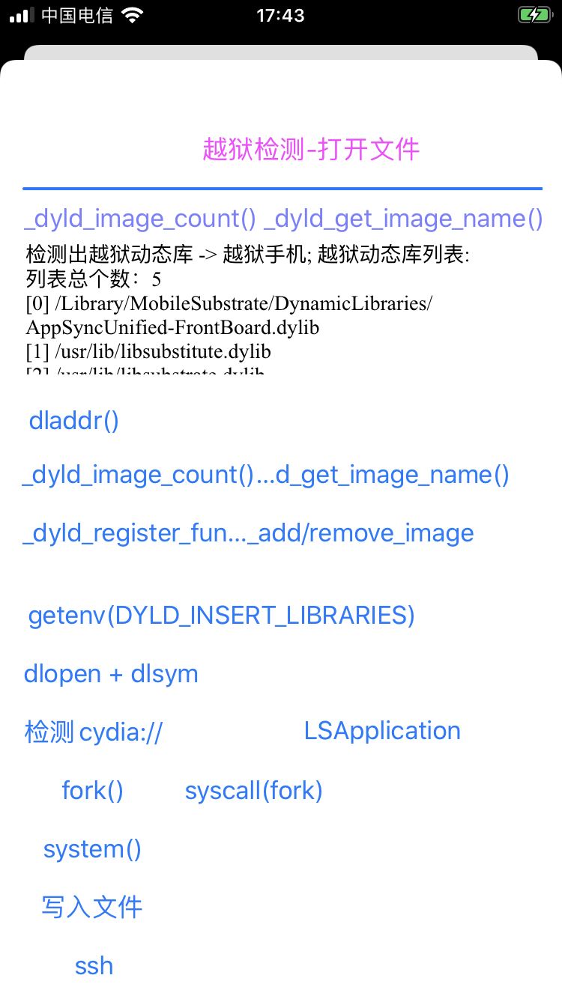
* `LSApplication`：是越狱手机，123个异常的app
  * 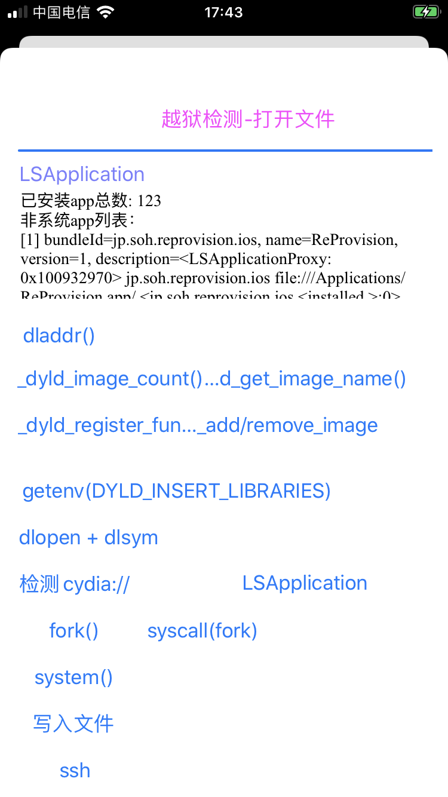
* `objc_copyImageNames`：是越狱手机，1个
  * 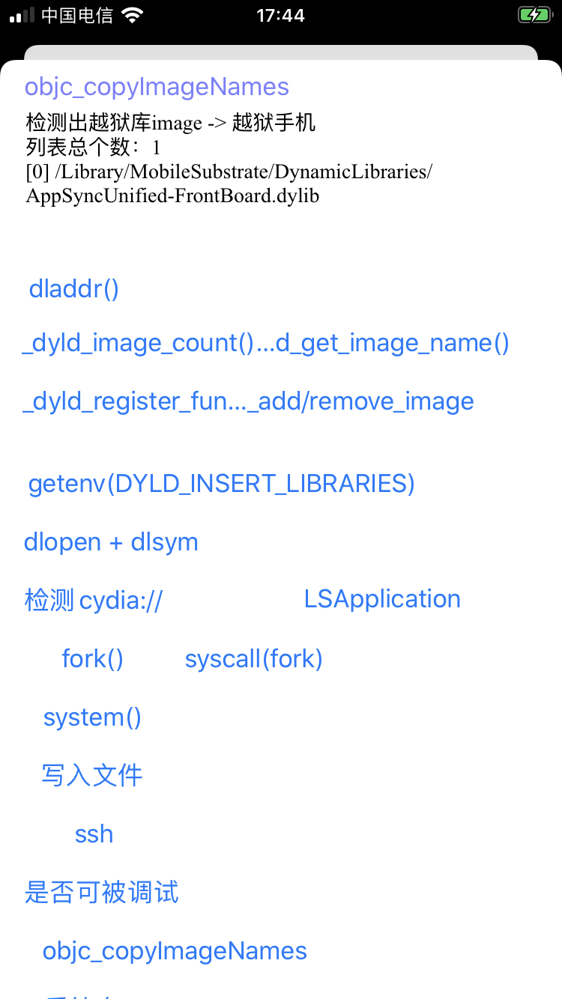
